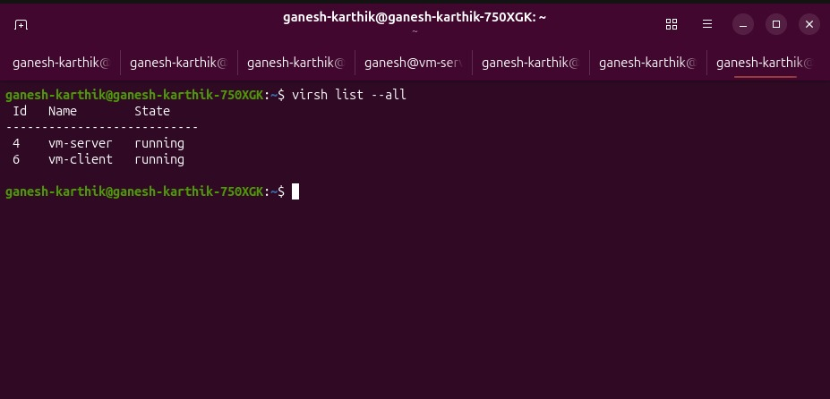
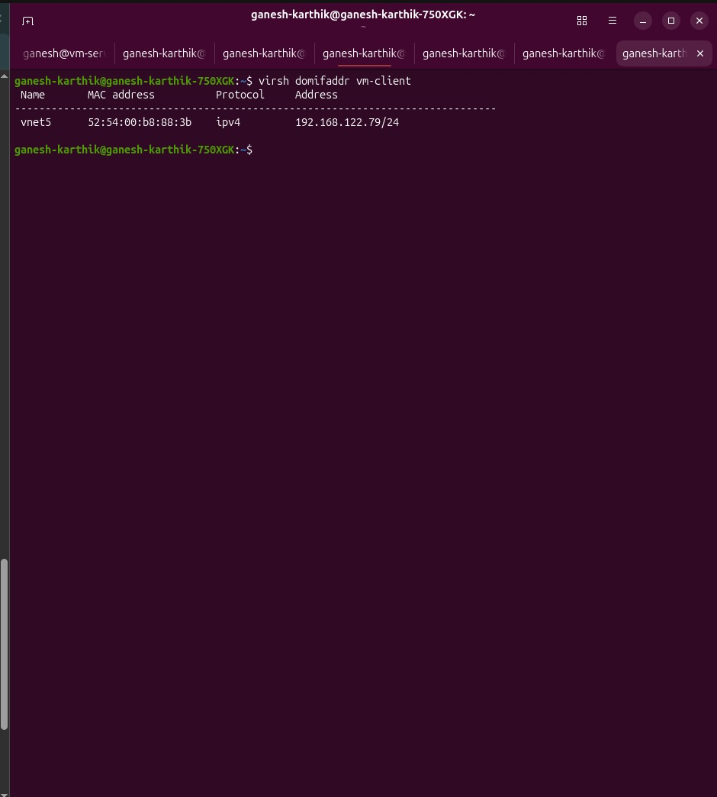
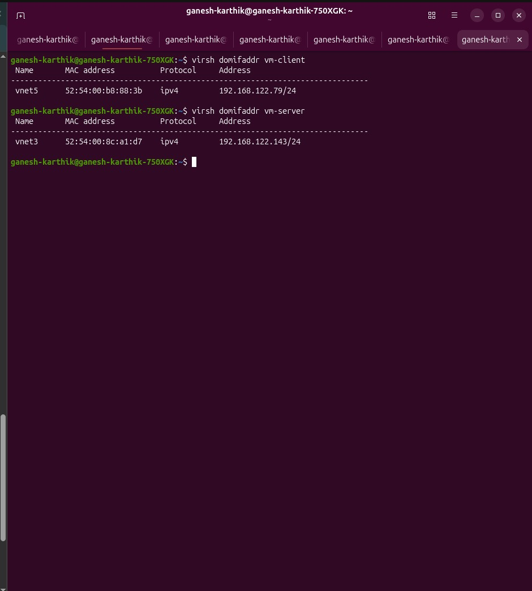
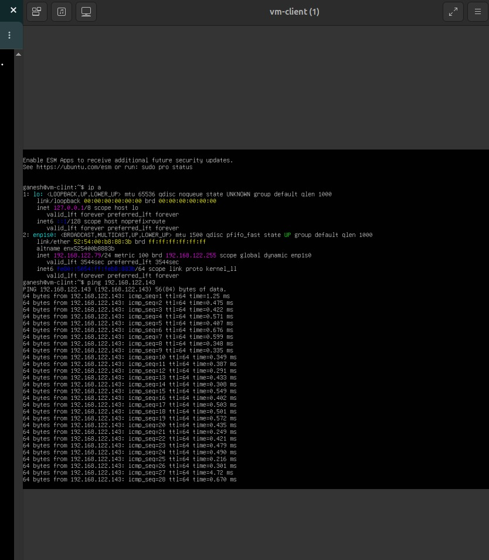
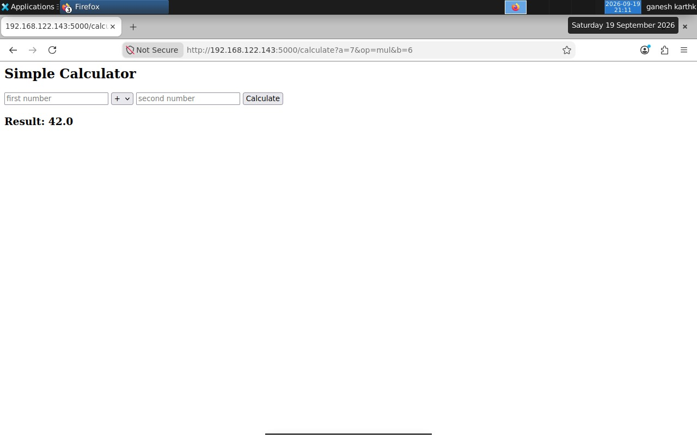

# Hardware-Assisted Virtualization: VM Web Server + Client

A QEMU/KVM and libvirt lab demonstrating two communicating virtual
machines on a virtual NAT network.

## Architecture

vm-client
│
│ HTTP
▼
vm-server
│
└── Flask Calculator

## Environment

- QEMU/KVM
- libvirt
- Ubuntu Server 26.04.1
- Python 3
- Flask
- libvirt default NAT network

## VMs

### vm-server

- 1 vCPU
- 1536 MB RAM
- 10 GB disk
- Flask application
- IP: 192.168.122.143

### vm-client

- 1 vCPU
- 2048 MB RAM
- 15 GB disk
- Lightweight GUI
- Web browser

## Networking

Both VMs use libvirt's default virtual network.

The client communicates with the Flask server using:

`http://<server-ip>:5000/`

## Calculator

Supports:

- Addition
- Subtraction
- Multiplication
- Division

## Screenshots

### Both VMs running

### Client VM

### Server VM

### VM Networking

### Client → Server Ping

### Calculator Result in Browser

